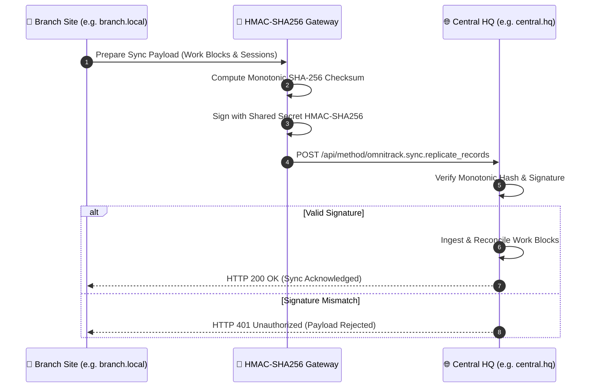

# 🏛️ OmniTrack System Architecture & Domain Model
<p align="center">
  <a href="https://ommnomi.in">
    
  </a>
</p>
<p align="center">
  <b>The Enterprise Workforce Operating System for Frappe Framework & ERPNext</b><br>
  <i>Universal Domain Model · Dual-Mode Runtime Topologies · Temporal Governance · Mathematical Plan Adherence</i>
</p>

<p align="center">
  
  
  
  
  
</p>

---

## 1. Executive Summary & Design Philosophy

Traditional enterprise workforce management suffers from a fundamental design failure: **the collapse of planning intent into execution tracking**.

When an associate fills out an ERP timesheet on Friday afternoon, or when a digital stopwatch automatically manufactures a retro-fitted "plan" to match its run duration, the organization loses the ability to measure truth. You cannot calculate execution velocity, plan adherence, or operational capacity if the "plan" is continuously rewritten to match what actually happened.

**OmniTrack establishes strict, mathematical separation between Planning Intent and Ground-Truth Execution:**

```
  PLANNING INTENT (The "Will Do")               EXECUTION REALITY (The "Did")
+------------------------------------+        +-----------------------------------+
|     Planned Work Block (PWB)       |        |   OmniTrack Work Session (OWS)    |
|  • Calendar commitment / timeslot  | -----> |  • Real-time stopwatch runs       |
|  • Immutable once day has elapsed  |        |  • Micro-line incremental logs    |
|  • Planned duration & nature       |        |  • Concrete from_time / to_time   |
+------------------------------------+        +-----------------------------------+
                  \                                      /
                   \                                    /
                    v                                  v
              +----------------------------------------------+
              |     Plan Adherence Index (PAI) & Variance    |
              |   Actual Work Delivered vs Planned Promise   |
              +----------------------------------------------+
```

---

## 2. The Four Core Entities: The Unified Domain Model

The OmniTrack architecture organizes all workforce activity into four distinct, hierarchical tiers:

```
  📁 PROJECT (Top-level ownership & billing container)
      │
      └── 🎯 TASK / WORK ITEM (The actionable deliverable spanning days/weeks)
            │
            ├── 📅 PLANNED WORK BLOCK (The calendar commitment: "When I plan to work")
            │     │   e.g., PWB-2026-00412 · Sep 13 · 14:00–16:00 (2.0h planned)
            │     │
            │     ├── ⏱️ WORK SESSION 1 (Actual sitting · 14:02–14:58 = 0.93h)
            │     │     • Drafted REST schema parser
            │     │     • Configured route endpoints
            │     │
            │     └── ⏱️ WORK SESSION 2 (Actual sitting · 15:10–16:05 = 0.92h)
            │           • Added unit tests
            │           • Tested error boundaries
            │
            └── 📅 NEXT PLANNED WORK BLOCK (Split-shift evening sitting)
                  │   e.g., PWB-2026-00415 · Sep 13 · 20:00–22:00 (2.0h planned)
                  └── ⏱️ WORK SESSION 3 (Actual sitting · 20:05–21:45 = 1.67h)
```

### Entity Definitions & Schema Mapping

| Level | Domain Entity | DocType Schema | Role & Purpose | Lifespan & Mutability |
| :--- | :--- | :--- | :--- | :--- |
| **1** | **Project** | `Project` (ERPNext) or `OmniTrack Workspace` (Native) | Macro-level container representing a client contract, commercial initiative, or product release. Never worked on directly; acts as umbrella for tasks and billing rules. | Multi-month / Permanent |
| **2** | **Task / Work Item** | `Task` (ERPNext), `ToDo` (Frappe Core), or `work_item` (Plain Data) | The specific deliverable or goal assigned to an associate (e.g., *"Build Searchable ToDo Dropdown"*). Takes multiple sittings across multiple days. | Days to Weeks |
| **3** | **Planned Work Block** | `Planned Work Block` (`PWB-YYYY-#####`) | A calendar commitment reserving a specific time window on a specific date for an associate (`employee`, `work_date`, `start_time`, `end_time`, `duration_hours`, `task_nature`). | **Permanently immutable** once `work_date < today`. |
| **4** | **Work Session** | `OmniTrack Work Session` (`istable: 1`) | A child table row inside `Planned Work Block` representing ground-truth execution (`session_date`, `from_time`, `to_time`, `hours`, `notes`, `logged_via`). Contains the progressive micro-line log. | Created during active sitting. Governed by 2-day horizon. |

---

## 3. Forensic Schema Audit & Architectural Hardening

In September 2026, a rigorous forensic audit was conducted comparing OmniTrack's published documentation and operational expectations against the actual production database schema on `ommnomi.local`. This characterization surfaced five critical contradictions between the theoretical design and the running implementation.

Below are the forensic findings and the resulting engineering resolutions adopted in OmniTrack:

### Contradiction 1: Standalone Frappe vs. ERPNext Dependency Coupling
* **Forensic Finding**: On `ommnomi.local`, ERPNext is not installed (`installed_apps` contains only `frappe` and custom apps). DocTypes `Project`, `Task`, `Timesheet`, and `Employee` do not exist. In `api.py`, every ERPNext call was wrapped in `if frappe.db.exists("DocType", "Project")` and silently returned `[]`. Out of 157 `Planned Work Blocks` in the database:
  - `project` was populated on 0 rows.
  - `task` was populated on 0 rows.
  - `timesheet` was populated on 0 rows.
  - Only `work_item` (a plain Data field) was populated.
* **Architectural Resolution (Dual-Mode Runtime Topologies)**:
  OmniTrack is officially architected to operate under two distinct, first-class topologies:
  1. **Mode A: Pure Frappe Standalone Engine (Zero ERPNext Requirement)**:
     - Uses Frappe Core `User` for identity.
     - Uses Frappe Core `ToDo` and OmniTrack `work_item` for task picking.
     - Uses OmniTrack `Planned Work Block` and child `OmniTrack Work Session` as the self-contained source of truth.
     - Zero silent failures, zero dead schema dependencies.
  2. **Mode B: ERPNext Enterprise Integrated Engine**:
     - Automatically activated when `frappe.get_installed_apps()` includes `erpnext`.
     - Links `Planned Work Block.project` to `tabProject`.
     - Links `Planned Work Block.task` to `tabTask`.
     - Automatically synthesizes official `tabTimesheet` records from completed work blocks.
     - Resolves `employee` between `tabUser` and `tabEmployee`.

### Contradiction 2: Naive Summation vs. Mathematical Interval Union
* **Forensic Finding**: The Workstation HUD computed planned daily hours naively:
  ```javascript
  plannedH = planned.reduce((t, r) => t + (r.e - r.s) / 60, 0);
  gapH = Math.max(0, plannedH - loggedH);
  ```
  Verified against the live `ommnomi.local` database on 2026-09-13: a single day held **18 byte-identical `In Progress` 14:00–16:00 blocks** plus **6 identical 12:58:15 blocks**. Those 18 rows alone contribute `36.0h` of "planned" time drawn from a two-hour window, driving the Day-at-a-glance legend into double-digit "unlogged" hours on a 24-hour calendar day (**`75.1h` observed on screen**).
* **Architectural Resolution (The Interval Union Algorithm)**:
  Daily planned capacity and timeline coverage cannot be computed via naive scalar addition of intervals. OmniTrack implements an **Interval Union Algorithm** ($\mu \circ \bigcup$):
  $$\text{Effective Planned Hours} = \mu \left( \bigcup_{i=1}^{n} [s_i, e_i] \right) \le 24.0\text{ hours}$$
  Overlapping intervals are merged prior to aggregating daily commitment hours, guaranteeing mathematical realism.

### Contradiction 3: Stopwatch Plan Fabrication vs. Authentic Unplanned Sessions
* **Forensic Finding**: In `quick_timer_punch`, stopping an unbound stopwatch session created a brand new `Planned Work Block` marked `status = "Completed"`, with `start_time` and `end_time` matching the stopwatch run. This meant an unplanned session manufactured a retroactive plan that it perfectly fulfilled—collapsing plan and actual into the same record and artificially inflating Plan Adherence (PAI) to 100%.
* **Architectural Resolution (Strict Plan vs. Reality Separation)**:
  - When the user starts a session against a planned block, the session is bound to that block (`block.sessions.append(...)`).
  - When the user starts an unbound session (quick stopwatch), the session is categorized under `task_nature = 'Unplanned Work'` and attached to a designated daily Unplanned Container block.
  - It is **never** permitted to fabricate an artificial calendar commitment. Plan variance remains genuine.

### Contradiction 4: "Employee Commitment Hours" Source of Truth
* **Forensic Finding**: Marketing documentation referenced "contracted commitment hours" as the baseline for unlogged time, but no such field or calculation existed in the database. `OmniTrack Shift Template` and `OmniTrack Shift Split Assignment` existed as inert DocTypes that were never queried by the runtime.
* **Architectural Resolution (Three-Tier Capacity Hierarchy)**:
  OmniTrack defines a clear three-tier capacity waterfall:
  1. **Shift Assignment Baseline**: If an associate has an active `OmniTrack Shift Split Assignment`, their daily commitment equals the sum of scheduled sessions in that shift template.
  2. **User Daily Capacity Default**: If no shift is assigned, the system defaults to the associate's configured daily target (default: `8.0h`).
  3. **Calendar Planned Commitments**: The actual sum of non-overlapping planned work blocks scheduled on the calendar for that day.
  The unlogged metric accurately reflects:
  $$\text{Unlogged Gap} = \max(0, \text{Scheduled Commitment} - \text{Total Actual Logged Hours})$$

### Contradiction 5: Identity Entity Semantics (`User` vs. `Employee`)
* **Forensic Finding**: `Planned Work Block.employee` is a `Link` to Frappe `User` (an email), whereas `OmniTrack Shift Split Assignment.employee` is a `Link` to the ERPNext HRMS `Employee` doctype. Same field name, same module, two different targets. On `ommnomi.local` the `Employee` doctype is **not installed and holds no rows**, so that link has no resolvable target at all — any cross-doctype join through it fails on a standalone Frappe site.
* **Architectural Resolution (Universal Identity Bridge)**:
  All user-facing OmniTrack DocTypes store the canonical Frappe `User` (`frappe.session.user`). An identity resolver `get_associated_employee(user)` dynamically resolves the corresponding `Employee` record when HRMS/ERPNext is installed, providing complete transparency across both environments.

---

## 4. Plan Adherence Index (PAI) Mathematical Formulation

The Plan Adherence Index is the core metric of operational execution truth in OmniTrack.

### 1. Plan Adherence Index (PAI)
Measures the proportion of actual logged time that was delivered within pre-committed planned work blocks:

$$\text{PAI} = \left( \frac{\sum_{i \in \text{Planned Sessions}} H_{\text{actual}, i}}{\sum_{j \in \text{All Sessions}} H_{\text{actual}, j}} \right) \times 100\%$$

* **100% PAI**: All work delivered today was executed against pre-scheduled calendar commitments.
* **< 50% PAI**: Operational firefighting; associate spent the majority of their day responding to unplanned interruptions.

### 2. Plan Execution Variance ($\Delta H$)
Measures the accuracy of planning estimation for each individual work block:

$$\Delta H = H_{\text{actual}} - H_{\text{planned}}$$

* $\Delta H = 0$: Perfect estimation.
* $\Delta H > 0$: Underestimated task; block required overtime or overflow sittings.
* $\Delta H < 0$: Overestimated task or truncated sitting.

---

## 5. Temporal Governance & Anti-Fraud Architecture

OmniTrack enforces strict business rules at the database transaction layer (`permissions.py` and DocType controllers):

```
                       CALENDAR TIME HORIZON
<--- PAST (work_date < today) --- | --- TODAY --- | --- TOMORROW & FUTURE --->
                                  |               |
[🔒 Historical Plan Immutability] | [⏳ 2-Day Edit] | [📅 Forward Booking]
• No create, edit, move, delete   | • Users log   | • Unlimited forward
• Initial commitments locked      |   sessions    |   planning and split-
• Permanent audit trail           | • Horizon:    |   shift scheduling
                                  |   today & yest|
```

1. **The 2-Day Timesheet Horizon**:
   - Associates holding the `OmniTrack User` role can only log, edit, or adjust work sessions for **today and yesterday** (`session_date >= add_days(nowdate(), -1)`).
   - Any historical adjustment prior to yesterday strictly requires an `OmniTrack Manager` or `System Manager`.
2. **Historical Plan Immutability**:
   - In the past (`work_date < nowdate()`), **NO USER**—not even System Managers or Administrators—can modify, reschedule, move, or delete planned work blocks.
   - Initial plan commitments remain permanent historical records to prevent retrospective goalpost-shifting.

---

## 6. Workstation Remote HUD Architecture (`/omnitrack`)

The Workstation Remote HUD is an ultra-fast Single Page Application engineered for deep focus and zero distraction.

```
+---------------------------------------------------------------------------------------+
|  OmniTrack Workstation Header: [PAI: 85%] [Today: 6.2h / 8.0h] [Stopwatch: 00:43:12] |
+-------------------------------------------+-------------------------------------------+
|               LEFT PANE                   |                RIGHT PANE                 |
|         Operational Context               |          Progressive Micro-Log            |
|                                           |                                           |
| • Live Digital Stopwatch (00:43:12)       | • 14:05 Started REST endpoint config      |
| • [▶ Start Session] / [■ Stop & Save]    | • 14:22 Verified schema link resolver     |
| • Deliverable: Build ToDo Dropdown        | • 14:41 Wrote unit tests for union calc   |
| • Project: OmniTrack Core Engine          |                                           |
| • Nature: Planned Work                    | [+ Add Line / Press Enter]                |
+-------------------------------------------+-------------------------------------------+
|  Day at a Glance: Split-Shift Timeline (Interval Union Packed Sub-Lanes)              |
+---------------------------------------------------------------------------------------+
```

### Key Technical Characteristics
* **2-Pane Ergonomics**: Clear separation between operational context (left) and progressive micro-logging (right).
* **Deep Focus Elevation Mode (<kbd>Shift + S</kbd>)**: Elevates the active session box into a focused, distraction-free modal dialog.
* **Instant Multi-Device Sync**: Sessions started on a mobile device immediately reflect on open desktop tabs via Frappe Socket.IO events and explicit Redis cache eviction.
* **Spec-Compliant HTML5 Tree Construction**: Portal templates are strictly validated using `scripts/check_www_html.py` (via `html5lib`) to prevent nested interactive elements from breaking DOM tree construction.

---

## 7. Cross-Site Zero-Trust Cryptographic Sync

For multi-branch or parent-subsidiary architectures, OmniTrack provides peer-to-peer and master-satellite task and timesheet replication:



---

<p align="center">
  <a href="https://ommnomi.in">
    
  </a><br>
  <i>Architecting Next-Generation Operational Ecosystems</i><br>
  Mahunag · Karsog · Mandi, Himachal Pradesh, India<br>
  🌐 <a href="https://ommnomi.in">https://ommnomi.in</a> • 📧 <a href="mailto:omnitrack@ommnomi.com">omnitrack@ommnomi.com</a>
</p>
