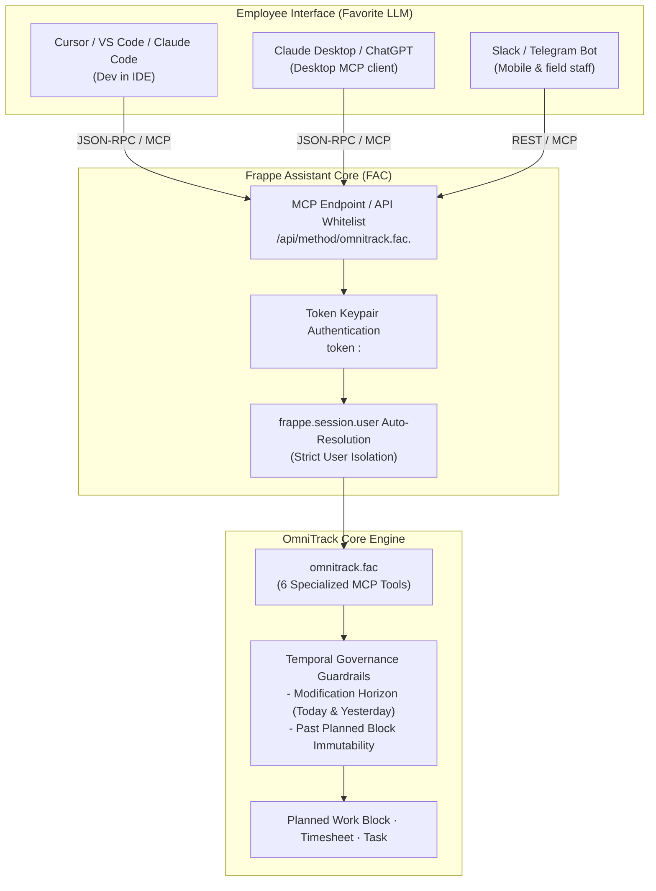

# OmniTrack + Frappe Assistant Core (FAC) Integration Guide

<span style="font-family:'Roboto',sans-serif;font-weight:900;"><span style="color:#4285f4;">Omm</span><span style="color:#34a853;">No</span><span style="color:#ea4335;">M</span><span style="color:#fbbc05;">i</span></span> Automation · OmniTrack Workforce & Workstation Ecosystem

---

## 🌟 Overview

When **OmniTrack** is installed alongside **Frappe Assistant Core (FAC)** on your Frappe / ERPNext bench, every employee can manage their day, log timesheets, track tasks, and control work sessions conversationally using their favorite LLM:
* **Developers in IDEs**: Cursor, VS Code, Claude Code, Antigravity
* **Desktop & Browser Power Users**: Claude Desktop, ChatGPT, Raycast, OpenWebUI
* **Field & Mobile Staff**: Slack, Teams, Telegram, WhatsApp AI bots, and Siri/Voice memos

---

## 🏛️ Architecture



---

## ⚙️ The 6 OmniTrack MCP Tools

FAC exposes six purpose-built domain tools for OmniTrack. Each tool enforces strict user scoping and temporal invariants automatically:

### 1. `omnitrack_get_my_workspace`
* **Purpose**: Retrieves the employee's live workstation data for today.
* **Returns**:
  * Active stopwatch timer state & elapsed time.
  * Today's planned work blocks, timings, task associations, and variance.
  * Total planned vs actual hours logged today.
  * Open assigned tasks (from ERPNext `Task` or Frappe `ToDo`).
* **Example Agent Query**: *"What's on my plate today and how much time have I logged so far?"*

### 2. `omnitrack_plan_work_blocks`
* **Purpose**: Batch schedules planned work blocks for a day (`09:00 - 11:00`, `11:00 - 13:00`, etc.).
* **Temporal Rule**: **Past dates (`work_date < today`) are strictly locked.** The assistant cannot book or alter historical commitments.
* **Example Agent Query**: *"Plan my day: 2 hrs on Gaonhae invoice bug starting at 9:30 AM, 1 hr team sync, and 3 hrs on CardView accessibility."*

### 3. `omnitrack_log_work_session`
* **Purpose**: Records a real work session against a planned block, or automatically creates an unplanned block and logs time into an ERPNext `Timesheet`.
* **Audit Rule**: **Session notes are mandatory (>= 3 characters)** describing what was delivered.
* **Temporal Rule**: Regular users can only log time for **today and yesterday**. Earlier historical back-fills require manager authorization.
* **Example Agent Query**: *"I just finished 90 minutes refactoring the Redis timeout handling. Log this under the CardView project with detailed notes."*

### 4. `omnitrack_quick_create_task`
* **Purpose**: Creates an ERPNext `Task` (or Frappe `ToDo`), assigns it to the current user, and optionally books a planned work block immediately.
* **Example Agent Query**: *"Create a high priority task 'Fix broken checkout redirect' under Project E-Commerce, estimated at 2 hours, and book it for 2 PM today."*

### 5. `omnitrack_quick_timer_action`
* **Purpose**: Controls live stopwatch sessions (`"start"`, `"stop"`, `"discard"`, `"status"`).
* **Terminology Invariant**: Terminology is strictly **"Start Session"** with Play icon (▶).
* **Clean Discard**: Allows 2-step discard to throw away false starts without creating empty timesheets.
* **Example Agent Query**: *"Start session on Task-0089"* or *"Stop session with note: finished all unit tests."*

### 6. `omnitrack_get_eod_reconciliation`
* **Purpose**: Audits the employee's day: checks total logged hours vs the 8.0-hour daily commitment, unallocated gaps, missing session notes, and temporal compliance.
* **Example Agent Query**: *"Audit my day before I sign off. Am I missing any notes or hours?"*

---

## 🛠️ Client Setup & Configurations

### A. Claude Desktop Configuration
Add the following to your `~/Library/Application Support/Claude/claude_desktop_config.json` (macOS) or `%APPDATA%\Claude\claude_desktop_config.json` (Windows):

```json
{
  "mcpServers": {
    "omnitrack": {
      "command": "npx",
      "args": [
        "-y",
        "@modelcontextprotocol/server-fetch",
        "https://your-site.frappe.cloud/api/method/omnitrack.fac."
      ],
      "env": {
        "AUTHORIZATION": "token <your_api_key>:<your_api_secret>"
      }
    }
  }
}
```

Or connect via the Frappe Assistant Core MCP endpoint:
```json
{
  "mcpServers": {
    "frappe_fac": {
      "command": "npx",
      "args": [
        "-y",
        "mcp-remote-client",
        "https://your-site.frappe.cloud/api/method/frappe_assistant_core.api.fac_endpoint.handle_mcp"
      ],
      "headers": {
        "Authorization": "token <your_api_key>:<your_api_secret>"
      }
    }
  }
}
```

---

### B. Cursor / VS Code Rule (`.cursorrules`)
Place this prompt in your project root as `.cursorrules` or `.github/copilot-instructions.md`:

```markdown
# OmniTrack Assistant Invariants

You are connected to the OmniTrack Workforce Engine via Frappe Assistant Core (FAC).
When managing timesheets, work blocks, or tasks, you MUST adhere to these invariants:

1. Temporal Modification Horizon:
   - Regular employees can only log or adjust timesheets for TODAY and YESTERDAY.
   - Any historical date prior to yesterday strictly requires an OmniTrack Manager.

2. Past Planned Work Blocks Lock:
   - In the past (work_date < today), NO ONE can create, reschedule, or edit planned work blocks. Historical plans are immutable.

3. Mandatory Session Notes:
   - Every logged session MUST have at least one descriptive line explaining what was delivered (>= 3 characters). Never log blank or "worked on stuff" notes.

4. Session Controls:
   - Terminology for starting a session is strictly "Start Session" (▶).
   - Stopping a session requires deliverable notes.
   - Abandoned or accidental sessions must use "discard" to avoid creating empty timesheets.

5. Morning Workflow:
   - When the user asks to plan their day, call `omnitrack_get_my_workspace` first to check assigned tasks and existing commitments, then call `omnitrack_plan_work_blocks`.
```

---

## 💬 Real Conversational Workflows

### 🌅 Morning 30-Second Day Planner
> **User:** *"Plan my day today. I start at 9:30 AM. I have a 30m team standup at 10 AM, and I want to spend the rest of the morning on task TASK-2026-0042, and the afternoon on CardView bug fixes."*
>
> **Assistant Action:**
> 1. Calls `omnitrack_get_my_workspace()` $\to$ verifies task details and project links.
> 2. Calls `omnitrack_plan_work_blocks`:
>    - `09:30 - 10:00`: Planning / Email check
>    - `10:00 - 10:30`: Team Standup (`🎯 Planned`)
>    - `10:30 - 13:00`: `TASK-2026-0042` — Feature Implementation (2.5 hrs)
>    - `14:00 - 18:00`: CardView Bug Fixes (4.0 hrs)
> 3. **Assistant Response:** *"Your day is scheduled for 7.0 planned hours across 4 work blocks. Tap 'Start Session' whenever you begin."*

---

### 💻 In-IDE Commit-to-Timesheet Logging
> **User:** *"I just pushed commit `fix(redis): add connection pool retry logic` after working on it for 1 hour 45 minutes. Log it on OmniTrack."*
>
> **Assistant Action:**
> 1. Calls `omnitrack_log_work_session`:
>    - `hours`: `1.75`
>    - `notes`: `"fix(redis): implemented connection pool retry with exponential backoff on cluster timeout"`
>    - `logged_via`: `"Cursor / IDE"`
> 2. **Assistant Response:** *"Logged 1.75 hours on your active work block. Linked ERPNext Timesheet updated (total today: 6.25 hrs)."*

---

### 🌆 End-of-Day Audit
> **User:** *"Audit my day before I head out."*
>
> **Assistant Action:**
> 1. Calls `omnitrack_get_eod_reconciliation()`
> 2. **Assistant Response:**
>    - **Status:** *On Track (8.25 hrs logged across 4 sessions).*
>    - **Deliverables:** *All sessions have descriptive notes.*
>    - **Plan Adherence:** *92% adherence to morning schedule.*
>    - *"Have a great evening!"*

---

## 🔒 Security & User Isolation

* **Strict Session Scoping**: The Frappe API keypair identifies the user via `frappe.session.user`.
* **Zero Privilege Escalation**: Non-manager users cannot target other employees' blocks or approve their own historical timesheets beyond yesterday.
* **Audit Trail**: Every session logged records `logged_via` (e.g. `AI Assistant`, `Cursor`, `Claude Desktop`) in the database for compliance reporting.

---

*OmmNoMi Automation LLP · Universal Workforce & Task Sync Engine*
